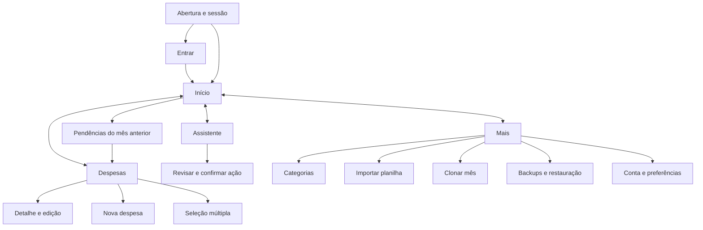

# Telas e fluxos — proposta inicial

Status: layouts conceituais, aguardando preferências. Os códigos identificam telas, etapas ou estados; não implicam uma página independente para cada item.

Compartilhamento confirmado (P01 e esclarecimento posterior): reutilizar os logins individuais já existentes na web e a mesma lista de despesas e categorias para Bruno e esposa. Início, Despesas e Categorias não terão seletor Pessoal/Casal. Não haverá recadastro, convite ou criação de espaço separado para começar a usar o celular. As capacidades e os dados bancários já acessíveis no sistema permanecem no escopo mobile.

## Navegação proposta

Barra inferior com quatro destinos: **Início**, **Despesas**, **Assistente**, **Mais**. A ação **Nova despesa** fica visível em Início e Despesas. Categoria, importação, clonagem e backups ficam em Mais, com atalhos contextuais na lista de despesas.



O mês ativo é explícito em Início, Despesas e Assistente. Ao alternar abas, preservar mês, busca e posição da lista. Ao trocar de mês, propor limpar a seleção múltipla para evitar exclusão de itens ocultos. Esta última regra difere do comportamento atual da web.

## Contrato visual para telas pequenas e médias

- Projeto responsivo dinâmico em 3 faixas de largura:
  - `< 768px` (Mobile): Coluna única, cabeçalho de 2 linhas, resumo em 2 níveis, botão flutuante de Nova Despesa (FAB), atalhos secundários no menu `MORE_VERT` e listagem de despesas em cards verticais independentes.
  - `768px a 1023px` (Compacto / Tablets / Janelas intermediárias): Cabeçalho em linha única, resumo em linha com 3 cards, botão Nova Despesa direto na barra, atalhos de Categorias/Clonar/Backups recolhidos no menu de 3 pontinhos para evitar cortes nas bordas, e despesas renderizadas no formato de cards fluidos para impedir esmagamento e quebras verticais de colunas.
  - `>= 1024px` (Desktop Amplo): Tabela completa de 8 colunas horizontais com textos protegidos com `no_wrap=True` e `TextOverflow.ELLIPSIS`, e todas as ações visíveis na barra superior.
- Alvos de toque propostos de pelo menos 48 × 48 unidades lógicas; texto principal a partir de 16, respeitando ampliação de fonte.
- Nada essencial depende apenas de cor, gesto oculto, tooltip ou hover.
- Valores monetários legíveis; descrição longa pode ocupar mais de uma linha e aparece integralmente no detalhe.
- Formulários extensos usam tela completa. Painéis inferiores ficam reservados a filtros, escolhas curtas e confirmações simples.
- Respeitar recortes, barras do Android e teclado. Botão de salvar e erro do campo devem continuar alcançáveis.
- Botão Voltar fecha primeiro teclado/painel, depois retorna à tela anterior; edição não salva exige escolha entre continuar e descartar.
- Estados de carregamento, vazio, erro, repetição e sessão expirada são previstos em todo fluxo de rede.
- Listas longas devem carregar de forma incremental; evitar reconstruir a tela inteira ao editar um item.

## Acesso

| ID | Tela/estado | Conteúdo e ações | Estados relevantes |
| --- | --- | --- | --- |
| A00 | Abertura | Marca breve, recuperação de sessão, encaminhamento | Sessão válida, ausente ou expirada; servidor indisponível |
| A01 | Entrar | E-mail e senha já usados na web, mostrar senha, Entrar | Credenciais inválidas, enviando, sem conexão |
| A02 | Cadastro | Nome, e-mail, senha, concluir pelo mesmo serviço da web | Somente para conta nova; usuários existentes entram diretamente |
| A03 | Sessão expirada | Explicação curta e retorno ao login | Tratamento de rascunho pendente sem executar ação automaticamente |

Recuperação de senha e biometria não existem na web; não entram como requisitos confirmados.

## Início e consulta

| ID | Tela/estado | Conteúdo e ações | Estados relevantes |
| --- | --- | --- | --- |
| H01 | Início | Mês, total, pago, pendente, percentual, Nova despesa, pendências anteriores | Mês vazio, atualizando, falha, última atualização |
| H02 | Pendências anteriores | Mês de origem, quantidade, total em aberto, lista e Abrir mês | Sem pendências; não representa consulta geral de atrasados |
| S01 | Escolher mês | Mês/ano, anterior/próximo e Voltar ao mês atual | Abrir como painel curto ou seletor dedicado |
| D01 | Despesas | Mês, busca, filtro de pendentes, lista por vencimento, Nova despesa | Nada cadastrado, nenhum resultado, seleção ativa, falha |
| D02 | Detalhe da despesa | Todos os campos, Editar, Marcar pago/pendente, Excluir | Item removido/alterado em outro aparelho |
| D03 | Nova/editar despesa | Descrição, valor, vencimento, categoria, status, pagamento e observação | Validação, salvando, erro recuperável, saída com alterações |
| D04 | Seleção múltipla | Selecionar, selecionar resultados filtrados, limpar, total/pago/pendente e Excluir | Confirmar quantidade e total; falha parcial explicitada |

Proposta de composição da lista:

```text
Despesas                  [Mês ▾]
[Buscar descrição ou categoria  ]
[Todas] [Pendentes]    [Selecionar]

Internet residencial     R$ 127,98
10 set · Outros          Pendente
[Abrir]                  [Pagar]

Escola                   R$ 850,00
30 set · Educação        Pago ✓

                    [+ Nova despesa]
Início | Despesas | Assistente | Mais
```

O botão Pagar é uma proposta de atalho; data automática ou escolha de data será decidida na entrevista. Pagamento e observação continuam acessíveis no detalhe. Cada ação tem alternativa explícita mesmo se gestos forem adicionados.

## Categorias

- **C01 — Lista:** nome, amostra de cor com identificação textual, criar, editar e excluir.
- **C02 — Criar/editar:** nome obrigatório, paleta e cor personalizada; salvar/cancelar; conflito de nome explicado.
- **C03 — Confirmar exclusão:** identificar categoria e explicar que as despesas serão mantidas, sem vínculo, exibidas como Outros. Política para excluir a própria categoria Outros pendente.

## Importação em quatro etapas

1. **I01 — Arquivo e abas:** selecionar CSV/XLS/XLSX pelo seletor Android; mostrar arquivo, abas e quantidade de linhas; importar todas ou escolher abas. Cancelamento retorna sem mudanças.
2. **I02 — Mapeamento:** um cartão por campo, com coluna e exemplo; obrigatórios: vencimento, descrição e valor. Exibir mês padrão e regra de distribuição. Abas com estruturas distintas devem ser reconhecidas antes da importação.
3. **I03 — Revisão:** quantidade e soma por mês, lista vertical de prévia, erros por linha e decisão sobre possíveis duplicatas, se esse recurso for aprovado. Nenhum dado gravado nesta etapa.
4. **I04 — Resultado:** progresso, contagens realmente gravadas, falhas e destino dos registros. Repetir uma solicitação não pode criar duplicações acidentais.

Não apresentar uma planilha larga que exija arrastar horizontalmente para revisar campos essenciais. Normalização de datas de pagamento e tratamento de linhas inválidas precisam ser especificados antes da implementação.

## Clonagem

- **L01 — Origem e destino:** selecionar meses diferentes; consultar contagem e total diretamente na fonte, inclusive meses ainda não abertos no app; informar registros existentes no destino.
- **L02 — Revisão e resultado:** informar quantidade, total, ajustes de dia e que todas ficarão pendentes/sem pagamento; confirmar; exibir resultado real e Abrir mês destino.
- Repetir clonagem para um destino já preenchido deve deixar claro que acrescenta registros. Política para repetição intencional a decidir.

## Backups

- **B01 — Histórico:** snapshots com data/hora, tipo, quantidades e total; Criar backup manual; explicar dias 1/15 e retenção de três.
- **B02 — Detalhe/revisão:** identificar snapshot e abrangência; explicar substituição de todas as categorias/despesas, não apenas o mês aberto; se compartilhado, afeta os dois.
- **B03 — Restaurar/resultado:** confirmação explícita, andamento, sucesso somente após conclusão e recarga; falha não deve aparentar restauração completa.
- Propor backup preventivo antes de restaurar; política de retenção e preservação do snapshot escolhido a decidir para evitar apagá-lo antes da operação.

## Assistente

- **Q01 — Conversa em tela completa:** mês em destaque, mensagens, campo de envio acima do teclado e atalhos Resumo, Pendentes, Maior gasto e Criar despesa.
- **Q02 — Resultados:** cartões de despesas ou dados bancários com identificação da fonte; valores legíveis e paginação para extratos longos. Não misturar totais da planilha com saldo bancário.
- **Q03 — Revisão de ação:** criar/editar/excluir despesa ou recategorizar transação bancária; mostrar entidade, mudanças e mês; Confirmar/Cancelar. Uma confirmação fica vinculada à proposta exibida, mesmo se o mês mudar depois.
- Criação assistida mantém uma pergunta por vez quando faltam dados. O chat não executa novamente uma ação já confirmada ao reenviar ou reabrir a conversa.
- Falhas do Groq, banco ou integração Open Finance são identificadas sem apagar a conversa.
- Histórico persistente e área bancária separada aguardam preferência.

## Mais e preferências

- **M01 — Mais:** Categorias, Importar, Clonar mês, Backups, tema, conta/sessão e Sair; versão do app e estado de conexão em área secundária.
- Conta/sessão exibe nome e e-mail da mesma identidade da web, duração/tempo restante e Sair. A regra existente de 24 horas é a base.
- Tema claro/escuro tem paridade; seguir tema do Android é melhoria proposta.
- Notificações do Android, biometria e configurações offline só ganham telas se aprovadas na entrevista. Gestão de membros não integra o escopo atual.

## Estados transversais

Não confundir mês sem despesas com consulta que falhou. Preservar rascunho em erros recuperáveis. Exibir confirmação de gravação, impedir toque duplo e sinalizar quando outro aparelho alterou o registro. Offline e conflitos dependem do modelo decidido, mas não podem resultar em perda silenciosa.
