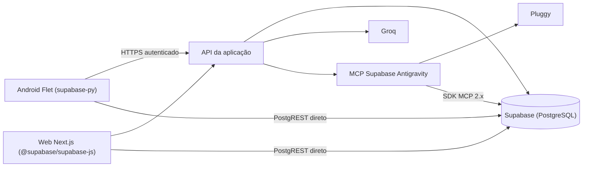

# Arquitetura e integração — proposta

## Direção recomendada

App Flet instalado no Android, com interface própria em Python, consumindo uma API autenticada e mantendo o Supabase como fonte compartilhada com a web. Reutilizar o serviço existente onde for adequado, completando os contratos que hoje existem apenas em funções do navegador.
App Flet instalado no Android, com interface própria em Python, acessando diretamente o Supabase (`supabase-py`) sem API intermediando, exatamente igual ao Web App (`@supabase/supabase-js`), mantendo o banco de dados como fonte única e compartilhada do casal.

Este é um desenho alvo proposto. Hoje a web acessa o Supabase diretamente em várias operações. Sua eventual migração para contratos comuns precisa de trabalho próprio; o desenho não descreve o estado atual nem autoriza alterações nesta etapa.
Tanto a web quanto o mobile se conectam diretamente ao Supabase via URL e chave pública (`NEXT_PUBLIC_SUPABASE_URL` e `NEXT_PUBLIC_SUPABASE_ANON_KEY`), sem intermediários.

## Fronteiras

Decisão confirmada P01 e esclarecimento posterior: reutilizar as identidades individuais já existentes na web e seu conjunto compartilhado de despesas/categorias. Não criar novo sistema de login, novas contas, convites ou um novo espaço do casal como requisito do Android. A autorização das operações deve ser verificada no servidor preservando o acesso legítimo existente, inclusive às capacidades bancárias do sistema.

## Login existente conferido no código

| Operação | Contrato existente | Aplicação no Android |
| --- | --- | --- |
| Entrar | `POST /api/auth/login`, JSON com `email` e `password` | Enviar as mesmas credenciais ao servidor web existente |
| Identidade | Tabela `mai_finance_users`, com UUID, nome, e-mail e hash | Reutilizar o mesmo registro; não acessar hashes pelo app |
| Sessão | Resposta com `user`, `expiresAt` e cookie `auth_token` HttpOnly | Cliente HTTP deve receber/retransmitir o cookie; persistência protegida será validada na implementação |
| Verificar | `GET /api/auth/me`, recebendo `auth_token` | Recuperar identidade e validade da sessão |
| Cadastrar | `POST /api/auth/register`, JSON com nome, e-mail e senha | Mesma conta passa a servir à web e ao Android; não é etapa exigida dos usuários atuais |
| Sair | `POST /api/auth/logout`, expira cookie | Encerrar sessão local e limpar armazenamento correspondente |

A sessão atual dura 24 horas. O JWT é emitido pelo servidor da aplicação, não pelo Supabase Auth. O mobile não deve chamar login do Supabase como substituto desse contrato. Mesmo login significa mesmas credenciais/identidade, não transferência automática do cookie do navegador para o aplicativo; cada cliente estabelece sua sessão com o serviço existente.

O logout atual apaga o cookie daquele cliente; não implementa revogação global em todos os dispositivos. Confirmar a URL HTTPS usada pela web antes da integração. Esta conferência é estática, sem teste de credenciais ou consulta ao banco de produção.

- Android: apresentação, navegação, formulários, validação imediata, seleção de arquivos e estado local conforme política offline escolhida.
- Servidor: autenticação/autorização, validação definitiva, confirmação de ações do chat, acesso bancário, importação/clonagem e restauração consistentes.
- Supabase: persistência e limites de acesso coerentes com o modelo de contas aprovado.
- Agendamento de backup: servidor/banco, independente de o app estar aberto.
- Segredos de Groq, Pluggy e assinatura de sessão permanecem no servidor. O APK não contém credenciais administrativas do banco.

## Capacidades de API necessárias

| Área | Contrato a especificar |
| --- | --- |
| Sessão | Login, cadastro conforme acesso aprovado, identidade, expiração, revogação/saída e transporte de sessão mobile |
| Despesas | Listar por mês com paginação, detalhe, criar, editar, status/pagamento e excluir |
| Lotes | Exclusão em lote com resultado por item ou atomicidade definida; idempotência para reenvios |
| Categorias | Listar, criar, renomear, mudar cor, excluir sem perder despesas |
| Resumos | Totais confiáveis do mês, totais filtrados/selecionados e pendências anteriores |
| Clonagem | Prévia da origem/destino, execução e resultado, tratamento de repetição |
| Importação | Arquivo/abas, prévia, mapeamento, normalização, validação e confirmação |
| Backups | Listar metadados, criar, revisar e restaurar de forma consistente |
| Assistente | Conversar, consultar fontes, gerar proposta e confirmar uma única execução autorizada |
| Sincronização | Atualização entre dispositivos, retomada do app, versão/conflito e repetição segura |

Rotas, formatos finais e tecnologias auxiliares não estão fixados. O cookie atual da web não deve ser presumido como uma sessão Supabase ou como solução pronta para o Android.

## Pontos encontrados no repositório que afetam o app

1. `lib/supabaseClient.ts` usa chave pública e não transmite a sessão própria ao Supabase; o SQL limita operações ao papel `authenticated`. É necessário verificar e alinhar autenticação, políticas e schema reais antes da integração.
2. Não há proprietário/família nas despesas, categorias ou backups. O requisito confirmado mantém os dados compartilhados existentes; não presumir necessidade de novo modelo de famílias para o Android.
3. Rotas de chat, consulta mensal e ação bancária não verificam a sessão no código atual. Os contratos mobile precisam aplicar autorização no servidor.
4. Categorias são gravadas com `color_hex`, `type` e `icon`, mas o schema versionado define `color`. O schema de produção não foi consultado nesta etapa.
5. Gravações de despesas, importação e clonagem podem absorver erros; o cliente precisa receber resultado verificável.
6. A restauração atual apaga e insere por chamadas separadas e ignora alguns erros. Definir execução atômica ou mecanismo de recuperação antes de expô-la no Android.
7. O SQL de cron tem delimitadores `$$` aninhados; verificar implantação do agendamento e retenção reais.
8. JWT tem segredo alternativo fixo no código; configuração de sessão mobile precisa eliminar dependência desse fallback.
9. Datas e valores são tratados de maneiras diferentes entre tabela, importação e chat. Especificar regras comuns e uso de decimal/centavos para dinheiro.
10. Cache de chat tem TTL em memória de 20 minutos, mas a rota recebe o histórico do cliente; não equivale a histórico durável entre aparelhos.

Esses pontos são evidências de leitura estática, não resultados de testes em produção. Corrigi-los será trabalho de implementação após a etapa de planejamento.

## Decisões técnicas dependentes da entrevista

- URL HTTPS do serviço existente e mecanismo de armazenamento protegido da sessão HTTP no Android.
- **[DEC-010 Confirmado]** Cache local por mês (`SharedPreferences`) para consulta offline com data/hora do snapshot; mutações (criar/editar/excluir/importar/clonar/restaurar) estritamente online, prevenindo conflitos concorrentes.
- Sessão de 24 horas como base de paridade; eventual biometria opcional, sem substituir as contas existentes.
- Importação processada no aparelho com prévia validada e envio do lote ao servidor.
- Consultas bancárias somente no chat ou também em telas próprias.
- APK privado e processo de atualização ou distribuição por loja.
- Celulares reais, versão mínima Android e volume de dados esperado.

## Verificação inicial do Flet

Consulta à documentação oficial em 2026-09-08:

- [Publicação Android](https://flet.dev/docs/publish/android/): Flet oferece empacotamento APK e AAB. Para dois aparelhos, APK assinado é uma proposta a discutir; confirmar versão, dependências e assinatura antes do build.
- [NavigationBar](https://flet.dev/docs/controls/navigationbar/): componente de navegação persistente adequado aos destinos principais propostos.
- [SafeArea](https://flet.dev/docs/controls/safearea/): referência para respeitar áreas ocupadas pelo sistema.
- [FilePicker](https://flet.dev/docs/services/filepicker/): referência para seleção de arquivos; validar o fluxo Android com arquivos locais e provedores disponíveis nos aparelhos.

Não há versão Flet fixada ainda. Validar APIs na versão escolhida, suporte Android dos pacotes Python, armazenamento protegido, comportamento com teclado e ciclo de vida. Existe ferramenta MCP Flet disponível na sessão para consultar a API na implementação.

## Desempenho proposto

- Requisições assíncronas, indicadores locais e cancelamento/descarte de respostas de meses antigos.
- Paginação/carregamento incremental para despesas, chat, prévias e extratos; não baixar snapshots completos para apenas listar backups.
- Atualizações de interface limitadas ao que mudou; nenhuma operação de rede bloqueia digitação ou rolagem.
- Atualizar dados ao retomar o app; definir reconexão e deduplicação conforme sincronização escolhida.
- Medir inicialização, memória, tamanho do APK e fluidez nos aparelhos do casal antes de estabelecer metas numéricas finais.
